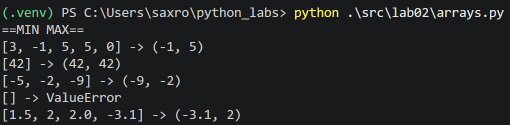
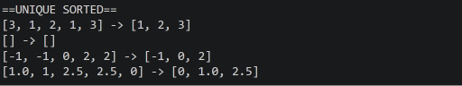
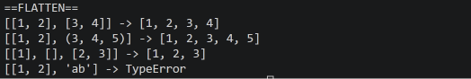
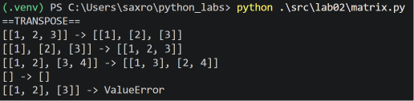
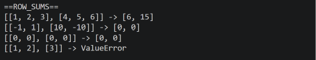
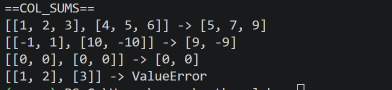

# ЛР2 — Коллекции и матрицы (list/tuple/set/dict)

## Задание 1

### 1.min_max()

```python
def min_max(nums: list[float | int]):
    '''
    Возвращает кортеж из максимального и минимального значения
    '''

    if len(nums) == 0:
        raise ValueError
    
    mn = nums[0]
    mx = nums[0]
    for a in nums:
        if a < mn:
            mn = a
        if a > mx:
            mx = a
    return (mn, mx)
```


### 2.unique_sorted()

```python
def unique_sorted(nums: list[float | int]):
    '''
    Возвращает список из отсортированных уникальных значений списка
    '''
    unique_nums = set(nums)

    return qsort(list(unique_nums))

def qsort(a):
    if len(a) < 2:
        return a
    elif len(a) == 2:
        return [min(a), max(a)]
    m = a[0]
    mins = []
    maxs = []
    for c in a[1:]:
        if c <= m:
            mins.append(c)
        else:
            maxs.append(c)
    return qsort(mins) + [m] + qsort(maxs)
```

Повторяющиеся значения убираются переводом списка в множество. Сортируется с помощью реализованной быстрой сортировки.



### 3.flatten()
```python
def flatten(mat: list[list | tuple]):
    '''
    Принимает список списков/кортежей. Возвращает один список из всех их элементов.
    '''
    out = []
    for a in mat:
        if type(a) not in [list, tuple]:
            raise TypeError
        out.extend(a)
    return out
```

Списки/кортежи объединяются с помощью функции extend



## Задание 2

### 1.transpose()

```python
def is_rect(mat: list[list[float | int]]):
    '''
    Проверяет матрицу на прямоугольность
    '''
    if len(mat) == 0:
        return True
    l = len(mat[0])

    for i in range(len(mat)):
        if len(mat[i]) != l:
            return False
    return True

def transpose(mat: list[list[float | int]]):
    '''
    Транспонирует матрицу
    '''
    if not is_rect(mat):
        raise ValueError
    if len(mat) == 0:
        return mat
    transposed = [[0 for i in range(len(mat))] for j in range(len(mat[0]))]
    for i in range(len(mat)):
        for j in range(len(mat[0])):
            transposed[j][i] = mat[i][j]
    return transposed
```

Проверка на прямоугольность вынесена в функцию is_rect.



### 2.row_sums

```python
def row_sums(mat: list[list[float | int]]):
    '''
    Возвращает суммы рядов матрицы. Требуется прямоугольность
    '''
    if not is_rect(mat):
        raise ValueError
    if len(mat) == 0:
        return mat

    sums = []
    for r in mat:
        sums.append(sum(r))

    return sums
```



### 3.col_sums

```python
def col_sums(mat: list[list[float | int]]):
    '''
    Возвращает суммы столбцов матрицы. Требуется прямоугольность
    '''
    if not is_rect(mat):
        raise ValueError
    if len(mat) == 0:
        return mat

    return row_sums(transpose(mat))
```

Так как столбцы матрицы - это строки транспонированной матрицы, можно воспользоваться ранее реализованными функциями row_sums и transpose.


