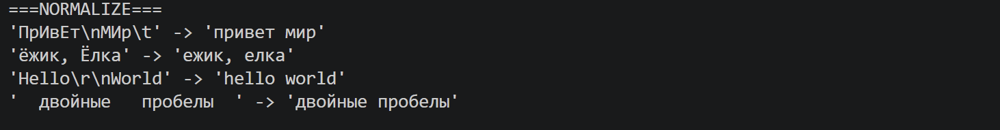
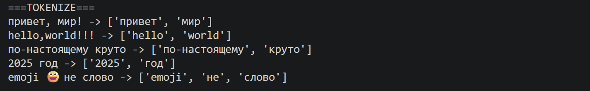
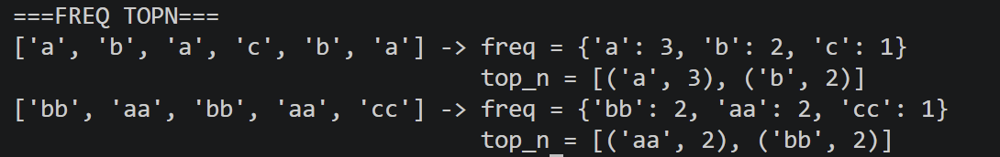
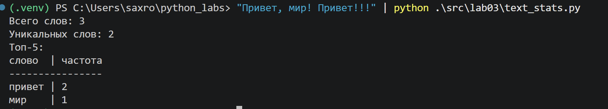

# ЛР3 — Тексты и частоты слов (словарь/множество)

## Задание A

### normalize()

```python
def normalize(text: str, *, casefold: bool = True, yo2e: bool = True) -> str:
    """
    Нормализация строки.
    При casefold = True использует s.casefold() иначе s.lower()
    При yo2e = True заменяет Ё на Е
    """
    if casefold:
        text = text.casefold()
    else:
        text = text.lower()

    if yo2e:
        text = text.replace("ё", "е").replace("Ё", "Е")

    text = re.sub(r"\s+", " ", text).strip()

    return text
```



### tokenize()

```python
def tokenize(text: str) -> list[str]:
    """
    Разбивает строку на слова.
    """

    return re.findall(r"\w+(?:-\w+)*", text, flags=re.UNICODE)
```



### count_freq() и top_n()

```python
def count_freq(tokens: list[str]) -> dict[str, int]:
    """
    Считает частоты каждого токена
    """

    freq  = {}

    for token in tokens:
        freq[token] = freq.get(token, 0) + 1

    return freq


def top_n(freq: dict[str, int], n: int = 5) -> list[tuple[str, int]]:
    """
    Возвращает топ-n самых встречающихся слов в алфавитном порядке
    """

    if n <= 0:
        return []

    return sorted(freq.items(), key=lambda item: (-item[1], item[0]))[:n]
```



## Задание B

```python
def print_stats(tokens: list[str], is_table: bool = True) -> None:
    freq = count_freq(tokens)
    top = top_n(freq, 5)

    print(f"Всего слов: {len(tokens)}")
    print(f"Уникальных слов: {len(freq)}")
    print("Топ-5:")

    if not top:
        return

    word_width = max(len(word) for word, _ in top)

    if is_table:
        print(f"{'слово':<{word_width}} | частота")
        print("-" * (word_width + 10))

        for word, count in top:
            print(f"{word:<{word_width}} | {count}")
    else:
        for word, count in top:
                    print(f"{word}:{count}")


def main():
    sys.stdin.reconfigure(encoding='utf-8')
    sys.stdout.reconfigure(encoding='utf-8')
    text = sys.stdin.read()

    normalized = normalize(text)
    tokens = tokenize(normalized)

    print_stats(tokens, True)
```

