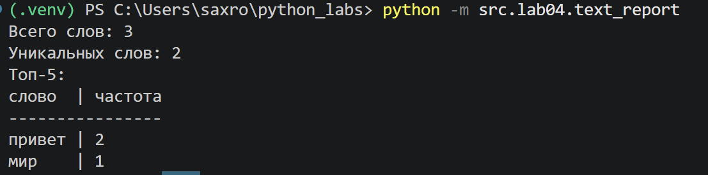
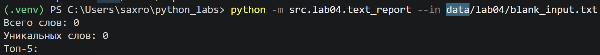
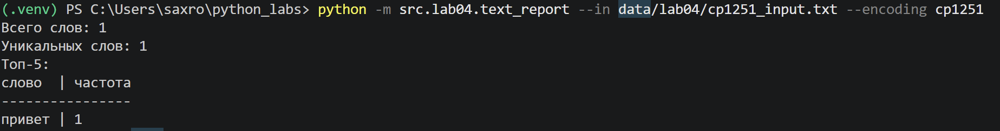
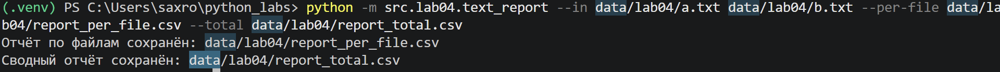

# ЛР4 — Файлы: TXT/CSV и отчёты по текстовой статистике

## Задание А

### read_text()
``` python
def read_text(path: str | Path, encoding: str = "utf-8") -> str:
    """
    Читает текстовый файл целиком и возвращает его содержимое одной строкой.

    По умолчанию используется кодировка UTF-8.
    Для другой кодировки можно передать её явно, например:
    read_text("data/input.txt", encoding="cp1251").

    Если файл не существует, возникает FileNotFoundError.
    Если кодировка не подходит, возникает UnicodeDecodeError.
    """
    p = Path(path)
    return p.read_text(encoding=encoding)
```

### write_csv()
``` python
def write_csv(rows: list[tuple | list], path: str | Path, header: tuple[str, ...] | None = None):
    """
    Записывает строки в CSV-файл.

    Если передан header, он записывается первой строкой.
    Все строки должны иметь одинаковую длину, иначе возникает ValueError.
    """
    if rows:
        expected_length = len(rows[0])

        for row in rows:
            if len(row) != expected_length:
                raise ValueError("Все строки CSV должны иметь одинаковую длину.")

        if header is not None and len(header) != expected_length:
            raise ValueError("Длина заголовка не совпадает с длиной строк.")

    elif header is not None:
        expected_length = len(header)
    else:
        expected_length = None

    p = Path(path)
    ensure_parent_dir(path)

    with p.open("w", newline="", encoding="utf-8") as f:
        writer = csv.writer(f)

        if header is not None:
            writer.writerow(header)

        for row in rows:
            writer.writerow(row)
```

### ensure_parent_dir()
``` python
def ensure_parent_dir(path: str | Path):
    """
    Создаёт родительские директории для указанного пути,
    если они ещё не существуют.
    """
    p = Path(path)
    p.parent.mkdir(parents=True, exist_ok=True)
```

### Мини-тесты

``` python
txt = read_text('data\\lab04\\input.txt')
print(repr(txt))
write_csv([("word","count"),("test",3)], "data/lab04/check.csv")
```
Консоль:

Содержимое check.csv:
```
word,count
test,3
```

## Задание B

``` python

```

## Тест-кейсы

### A. Один файл (база)

Вход (data/lab04/input.txt):
```
Привет, мир! Привет!!!
```

Консоль:


Отчёт (data/lab04/report.csv):
```
word,count
привет,2
мир,1
```

### B. Пустой файл

Вход: пустой файл blank_input.txt

Консоль:


Отчёт (только заголовок):
```
word,count
```

### C. Кодировка cp1251

Вход (data/lab04/cp1251_input.txt в кодировке cp1251):
```
Привет
```

Консоль:


Отчёт (data/lab04/report.csv):
```
word,count
привет,1
```

### D★. Несколько файлов (пер‑файл и сводный)

Вход:
a.txt
```
Привет мир
```
b.txt
```
Привет, привет!
```

Консоль:


Пер-файл отчёт (data/lab04/report_per_file.csv):
```
file,word,count
a.txt,мир,1
a.txt,привет,1
b.txt,привет,2
```

Сводный отчёт (data/lab04/report_total.csv):
```
word,count
привет,3
мир,1
```